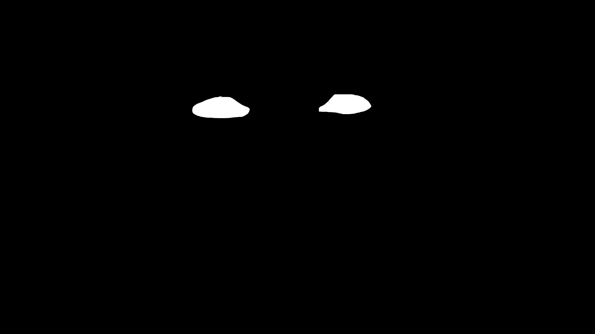

## Creative Coding 2: Custom Pixel
### Emerson Hemingway

For this project I began by looking at the class examples and brainstorming what subject matter I may be interested in focusing on for this assignment. At first I was interested in focusing on plants but upon further brainstorming I landed on the idea of focusing on eyes and having my filter warp this in some way.

With my theming of eyes I want my assignment to portray a twist on "the eyes are the window to the soul". I want to present that people can warp and manipulate others perception of themselves by acting presenting themselves in certain ways.

After deciding on this theme I began sourcing some test images to start training the AI to begin to recognise this subject.

First training images and masks:

After processing these images with my input new:

I received an essentially blank mask back from the process:

This showed me that I needed to provide more training images to have the system begin to recognise what my masks were highlighting.

I repeated this process and the output was much more accurate than my first attempt.

Second lot of training images and masks:

The new mask outputs for my new input images were much more accurate and recgonised my subject matter efficiently.

Once I processed my images through the system I began looking at how I want my filter to edit my subject matter.

I began with a basic wavy effect on my subject.
.jpg>)

After this I played around with the code a bit more and created this effect:
.jpg>)

After viewing both of these results I decided to pursue the [p5.js wavy example](https://github.com/23-2-DSDN242/mddn-242-data-mapping-dribnet/blob/8102140af8a1de2b7ac0ee6fc219f80a70329b7f/sketch.js) for my pixel treatment. I like the way this treatment supports my projec theming with a distortion effect.

Final Images:

Images sourced from pexels:
https://www.pexels.com/photo/photography-of-a-guy-wearing-green-shirt-1222271/
https://www.pexels.com/photo/man-in-brown-polo-shirt-614810/
https://www.pexels.com/photo/sensual-plus-size-female-with-shiny-rhinestone-on-face-looking-at-camera-3843382/
https://www.pexels.com/photo/serious-young-lady-with-colorful-stickers-on-face-and-hair-clips-against-green-background-6974021/
https://www.pexels.com/photo/old-lady-touching-temples-in-studio-7544645/
https://www.pexels.com/photo/young-woman-filming-video-in-light-apartment-7516247/
https://www.pexels.com/photo/calm-young-ethnic-woman-with-perfect-skin-touching-face-after-shower-5938648/
https://www.pexels.com/photo/stylish-ethnic-male-teenager-standing-on-street-near-weathered-wall-5721443/
https://www.pexels.com/photo/charming-woman-with-freckles-in-room-6001808/